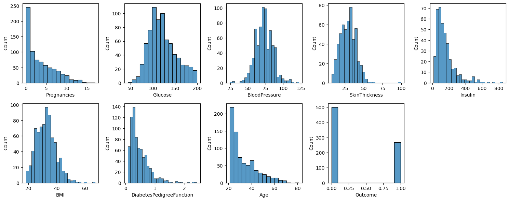
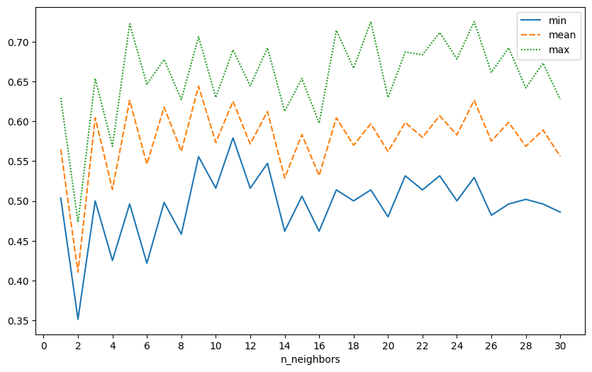

# Classification - Diabetes Prediction

https://www.kaggle.com/datasets/uciml/pima-indians-diabetes-database

## Data dictionary

|Variable|Definition|
|:-------|:-------|
Pregnancies|Number of times pregnant
Glucose|Plasma glucose concentration a 2 hours in an oral glucose tolerance test
BloodPressure|Diastolic blood pressure (mm Hg)
SkinThickness|Triceps skin fold thickness (mm)
Insulin|2-Hour serum insulin (mu U/ml)
BMI|Body mass index (weight in kg/(height in m)^2)
DiabetesPedigreeFunction|Diabetes pedigree function
Age|Age (years)
Outcome|Class variable (0 or 1) 268 of 768 are 1, the others are 0


```python
import numpy as np
import pandas as pd
import seaborn as sns
import matplotlib.pyplot as plt
import matplotlib.ticker as ticker
import math

import sklearn
from sklearn.tree import DecisionTreeClassifier
from sklearn.svm import SVC, LinearSVC
from sklearn.neural_network import MLPClassifier
from sklearn.neighbors import KNeighborsClassifier
from sklearn.naive_bayes import GaussianNB
from sklearn.ensemble import RandomForestClassifier, AdaBoostClassifier, HistGradientBoostingClassifier, StackingClassifier

from sklearn.model_selection import train_test_split, StratifiedKFold, KFold, cross_val_score
from sklearn.metrics import accuracy_score, f1_score, recall_score, precision_score, confusion_matrix, auc, ConfusionMatrixDisplay, fbeta_score
from sklearn.preprocessing import OrdinalEncoder, StandardScaler
from sklearn.utils import resample
```


```python
df = pd.read_csv('diabetes.csv', sep=',')
```

## Basic analysis


```python
df
```


<div>
<style scoped>
    .dataframe tbody tr th:only-of-type {
        vertical-align: middle;
    }

    .dataframe tbody tr th {
        vertical-align: top;
    }

    .dataframe thead th {
        text-align: right;
    }
</style>
<table border="1" class="dataframe">
  <thead>
    <tr style="text-align: right;">
      <th></th>
      <th>Pregnancies</th>
      <th>Glucose</th>
      <th>BloodPressure</th>
      <th>SkinThickness</th>
      <th>Insulin</th>
      <th>BMI</th>
      <th>DiabetesPedigreeFunction</th>
      <th>Age</th>
      <th>Outcome</th>
    </tr>
  </thead>
  <tbody>
    <tr>
      <th>0</th>
      <td>6</td>
      <td>148</td>
      <td>72</td>
      <td>35</td>
      <td>0</td>
      <td>33.6</td>
      <td>0.627</td>
      <td>50</td>
      <td>1</td>
    </tr>
    <tr>
      <th>1</th>
      <td>1</td>
      <td>85</td>
      <td>66</td>
      <td>29</td>
      <td>0</td>
      <td>26.6</td>
      <td>0.351</td>
      <td>31</td>
      <td>0</td>
    </tr>
    <tr>
      <th>2</th>
      <td>8</td>
      <td>183</td>
      <td>64</td>
      <td>0</td>
      <td>0</td>
      <td>23.3</td>
      <td>0.672</td>
      <td>32</td>
      <td>1</td>
    </tr>
    <tr>
      <th>3</th>
      <td>1</td>
      <td>89</td>
      <td>66</td>
      <td>23</td>
      <td>94</td>
      <td>28.1</td>
      <td>0.167</td>
      <td>21</td>
      <td>0</td>
    </tr>
    <tr>
      <th>4</th>
      <td>0</td>
      <td>137</td>
      <td>40</td>
      <td>35</td>
      <td>168</td>
      <td>43.1</td>
      <td>2.288</td>
      <td>33</td>
      <td>1</td>
    </tr>
    <tr>
      <th>...</th>
      <td>...</td>
      <td>...</td>
      <td>...</td>
      <td>...</td>
      <td>...</td>
      <td>...</td>
      <td>...</td>
      <td>...</td>
      <td>...</td>
    </tr>
    <tr>
      <th>763</th>
      <td>10</td>
      <td>101</td>
      <td>76</td>
      <td>48</td>
      <td>180</td>
      <td>32.9</td>
      <td>0.171</td>
      <td>63</td>
      <td>0</td>
    </tr>
    <tr>
      <th>764</th>
      <td>2</td>
      <td>122</td>
      <td>70</td>
      <td>27</td>
      <td>0</td>
      <td>36.8</td>
      <td>0.340</td>
      <td>27</td>
      <td>0</td>
    </tr>
    <tr>
      <th>765</th>
      <td>5</td>
      <td>121</td>
      <td>72</td>
      <td>23</td>
      <td>112</td>
      <td>26.2</td>
      <td>0.245</td>
      <td>30</td>
      <td>0</td>
    </tr>
    <tr>
      <th>766</th>
      <td>1</td>
      <td>126</td>
      <td>60</td>
      <td>0</td>
      <td>0</td>
      <td>30.1</td>
      <td>0.349</td>
      <td>47</td>
      <td>1</td>
    </tr>
    <tr>
      <th>767</th>
      <td>1</td>
      <td>93</td>
      <td>70</td>
      <td>31</td>
      <td>0</td>
      <td>30.4</td>
      <td>0.315</td>
      <td>23</td>
      <td>0</td>
    </tr>
  </tbody>
</table>
<p>768 rows × 9 columns</p>
</div>


```python
df.shape
```


    (768, 9)


```python
df.dtypes
```


    Pregnancies                   int64
    Glucose                       int64
    BloodPressure                 int64
    SkinThickness                 int64
    Insulin                       int64
    BMI                         float64
    DiabetesPedigreeFunction    float64
    Age                           int64
    Outcome                       int64
    dtype: object


```python
df.isna().sum().sort_values(ascending=False)
```


    Pregnancies                 0
    Glucose                     0
    BloodPressure               0
    SkinThickness               0
    Insulin                     0
    BMI                         0
    DiabetesPedigreeFunction    0
    Age                         0
    Outcome                     0
    dtype: int64


**Missing values are allegedly represented as zeros (except Pregnancies and Outcome, where zero is a valid value):**


```python
def print_zero_counts():
    zero_counts = dict()
    for col in df.columns:
        zero_counts[col] = df.loc[df[col] == 0, col].count()

    sorted_col_zero_counts = sorted(zero_counts.items(), key=lambda item: item[1], reverse=True)
    for col, zero_count in sorted_col_zero_counts:
        print(f'{col:30} {zero_count}')
print_zero_counts()
```

    Outcome                        500
    Insulin                        374
    SkinThickness                  227
    Pregnancies                    111
    BloodPressure                  35
    BMI                            11
    Glucose                        5
    DiabetesPedigreeFunction       0
    Age                            0
    


```python
for col in df.drop(['Pregnancies', 'Outcome'], axis=1).columns:
    df[col].replace(0, float('NaN'), inplace=True)
```


```python
print_zero_counts()
```

    Outcome                        500
    Pregnancies                    111
    Glucose                        0
    BloodPressure                  0
    SkinThickness                  0
    Insulin                        0
    BMI                            0
    DiabetesPedigreeFunction       0
    Age                            0
    


```python
df.isna().sum().sort_values(ascending=False)
```


    Insulin                     374
    SkinThickness               227
    BloodPressure                35
    BMI                          11
    Glucose                       5
    Pregnancies                   0
    DiabetesPedigreeFunction      0
    Age                           0
    Outcome                       0
    dtype: int64


```python
df.dtypes
```


    Pregnancies                   int64
    Glucose                     float64
    BloodPressure               float64
    SkinThickness               float64
    Insulin                     float64
    BMI                         float64
    DiabetesPedigreeFunction    float64
    Age                           int64
    Outcome                       int64
    dtype: object


```python
df.describe()
```


<div>
<style scoped>
    .dataframe tbody tr th:only-of-type {
        vertical-align: middle;
    }

    .dataframe tbody tr th {
        vertical-align: top;
    }

    .dataframe thead th {
        text-align: right;
    }
</style>
<table border="1" class="dataframe">
  <thead>
    <tr style="text-align: right;">
      <th></th>
      <th>Pregnancies</th>
      <th>Glucose</th>
      <th>BloodPressure</th>
      <th>SkinThickness</th>
      <th>Insulin</th>
      <th>BMI</th>
      <th>DiabetesPedigreeFunction</th>
      <th>Age</th>
      <th>Outcome</th>
    </tr>
  </thead>
  <tbody>
    <tr>
      <th>count</th>
      <td>768.000000</td>
      <td>763.000000</td>
      <td>733.000000</td>
      <td>541.000000</td>
      <td>394.000000</td>
      <td>757.000000</td>
      <td>768.000000</td>
      <td>768.000000</td>
      <td>768.000000</td>
    </tr>
    <tr>
      <th>mean</th>
      <td>3.845052</td>
      <td>121.686763</td>
      <td>72.405184</td>
      <td>29.153420</td>
      <td>155.548223</td>
      <td>32.457464</td>
      <td>0.471876</td>
      <td>33.240885</td>
      <td>0.348958</td>
    </tr>
    <tr>
      <th>std</th>
      <td>3.369578</td>
      <td>30.535641</td>
      <td>12.382158</td>
      <td>10.476982</td>
      <td>118.775855</td>
      <td>6.924988</td>
      <td>0.331329</td>
      <td>11.760232</td>
      <td>0.476951</td>
    </tr>
    <tr>
      <th>min</th>
      <td>0.000000</td>
      <td>44.000000</td>
      <td>24.000000</td>
      <td>7.000000</td>
      <td>14.000000</td>
      <td>18.200000</td>
      <td>0.078000</td>
      <td>21.000000</td>
      <td>0.000000</td>
    </tr>
    <tr>
      <th>25%</th>
      <td>1.000000</td>
      <td>99.000000</td>
      <td>64.000000</td>
      <td>22.000000</td>
      <td>76.250000</td>
      <td>27.500000</td>
      <td>0.243750</td>
      <td>24.000000</td>
      <td>0.000000</td>
    </tr>
    <tr>
      <th>50%</th>
      <td>3.000000</td>
      <td>117.000000</td>
      <td>72.000000</td>
      <td>29.000000</td>
      <td>125.000000</td>
      <td>32.300000</td>
      <td>0.372500</td>
      <td>29.000000</td>
      <td>0.000000</td>
    </tr>
    <tr>
      <th>75%</th>
      <td>6.000000</td>
      <td>141.000000</td>
      <td>80.000000</td>
      <td>36.000000</td>
      <td>190.000000</td>
      <td>36.600000</td>
      <td>0.626250</td>
      <td>41.000000</td>
      <td>1.000000</td>
    </tr>
    <tr>
      <th>max</th>
      <td>17.000000</td>
      <td>199.000000</td>
      <td>122.000000</td>
      <td>99.000000</td>
      <td>846.000000</td>
      <td>67.100000</td>
      <td>2.420000</td>
      <td>81.000000</td>
      <td>1.000000</td>
    </tr>
  </tbody>
</table>
</div>


```python
def plot_numeric_columns(plot_func, cols_per_row = 5, col_size=2, row_size=3, df=df):
    cols = df.select_dtypes(include=np.number).columns
    total_rows = math.ceil(len(cols) / cols_per_row)

    fig, ax = plt.subplots(total_rows, cols_per_row, figsize=(cols_per_row * col_size, total_rows * row_size))
    ax = ax.flatten()
    for i, col in enumerate(cols):
      plot_func(col, ax[i])
    for i in range(len(cols), cols_per_row * total_rows):
      fig.delaxes(ax[i])
    plt.tight_layout()
    plt.show()
```


```python
plot_numeric_columns(lambda col, ax: sns.boxplot(data=df, y=col, ax=ax))
```


    

    


```python
plot_numeric_columns(lambda col, ax: sns.histplot(data=df, x=col, ax=ax), col_size=3)
```


    

    


```python
plt.figure(figsize=(12, 9))
sns.heatmap(df.corr(numeric_only=True), square=True, cmap='RdYlGn', vmin=-1, vmax=1, annot=True)
```


    <AxesSubplot: >


    

    


```python
sns.countplot(df, x='Outcome')
```


    <AxesSubplot: xlabel='Outcome', ylabel='count'>


    

    


```python
plot_numeric_columns(lambda col, ax: sns.boxplot(data=df, y=col, x='Outcome', ax=ax), col_size=3)
```


    

    


```python
plot_numeric_columns(lambda col, ax: sns.histplot(data=df, x=col, hue='Outcome', ax=ax), col_size=3)
```


    

    


## Preprocessing
The Outcome column will be predicted based on all other columns.

### Deal with missing values
I will replace all missing values with the mean of respective columns.


```python
df.isnull().any(axis=0)
```


    Pregnancies                 False
    Glucose                      True
    BloodPressure                True
    SkinThickness                True
    Insulin                      True
    BMI                          True
    DiabetesPedigreeFunction    False
    Age                         False
    Outcome                     False
    dtype: bool


```python
df.columns[df.isnull().any(axis=0)]
```


    Index(['Glucose', 'BloodPressure', 'SkinThickness', 'Insulin', 'BMI'], dtype='object')


```python
for col in df.columns[df.isnull().any(axis=0)]:
    df[col].fillna(df[col].mean(),inplace=True)
```


```python
df.isna().sum().sort_values(ascending=False)
```


    Pregnancies                 0
    Glucose                     0
    BloodPressure               0
    SkinThickness               0
    Insulin                     0
    BMI                         0
    DiabetesPedigreeFunction    0
    Age                         0
    Outcome                     0
    dtype: int64


```python
plot_numeric_columns(lambda col, ax: sns.histplot(data=df, x=col, ax=ax), col_size=3)
```


    

    


### Scale values
I will apply MinMaxScaler to all columns to prevent any models (notably k-NN) from having inferior performance.


```python
X, y = df.loc[:, df.columns != 'Outcome'], df.loc[:, 'Outcome']
```


```python
X
```


<div>
<style scoped>
    .dataframe tbody tr th:only-of-type {
        vertical-align: middle;
    }

    .dataframe tbody tr th {
        vertical-align: top;
    }

    .dataframe thead th {
        text-align: right;
    }
</style>
<table border="1" class="dataframe">
  <thead>
    <tr style="text-align: right;">
      <th></th>
      <th>Pregnancies</th>
      <th>Glucose</th>
      <th>BloodPressure</th>
      <th>SkinThickness</th>
      <th>Insulin</th>
      <th>BMI</th>
      <th>DiabetesPedigreeFunction</th>
      <th>Age</th>
    </tr>
  </thead>
  <tbody>
    <tr>
      <th>0</th>
      <td>6</td>
      <td>148.0</td>
      <td>72.0</td>
      <td>35.00000</td>
      <td>155.548223</td>
      <td>33.6</td>
      <td>0.627</td>
      <td>50</td>
    </tr>
    <tr>
      <th>1</th>
      <td>1</td>
      <td>85.0</td>
      <td>66.0</td>
      <td>29.00000</td>
      <td>155.548223</td>
      <td>26.6</td>
      <td>0.351</td>
      <td>31</td>
    </tr>
    <tr>
      <th>2</th>
      <td>8</td>
      <td>183.0</td>
      <td>64.0</td>
      <td>29.15342</td>
      <td>155.548223</td>
      <td>23.3</td>
      <td>0.672</td>
      <td>32</td>
    </tr>
    <tr>
      <th>3</th>
      <td>1</td>
      <td>89.0</td>
      <td>66.0</td>
      <td>23.00000</td>
      <td>94.000000</td>
      <td>28.1</td>
      <td>0.167</td>
      <td>21</td>
    </tr>
    <tr>
      <th>4</th>
      <td>0</td>
      <td>137.0</td>
      <td>40.0</td>
      <td>35.00000</td>
      <td>168.000000</td>
      <td>43.1</td>
      <td>2.288</td>
      <td>33</td>
    </tr>
    <tr>
      <th>...</th>
      <td>...</td>
      <td>...</td>
      <td>...</td>
      <td>...</td>
      <td>...</td>
      <td>...</td>
      <td>...</td>
      <td>...</td>
    </tr>
    <tr>
      <th>763</th>
      <td>10</td>
      <td>101.0</td>
      <td>76.0</td>
      <td>48.00000</td>
      <td>180.000000</td>
      <td>32.9</td>
      <td>0.171</td>
      <td>63</td>
    </tr>
    <tr>
      <th>764</th>
      <td>2</td>
      <td>122.0</td>
      <td>70.0</td>
      <td>27.00000</td>
      <td>155.548223</td>
      <td>36.8</td>
      <td>0.340</td>
      <td>27</td>
    </tr>
    <tr>
      <th>765</th>
      <td>5</td>
      <td>121.0</td>
      <td>72.0</td>
      <td>23.00000</td>
      <td>112.000000</td>
      <td>26.2</td>
      <td>0.245</td>
      <td>30</td>
    </tr>
    <tr>
      <th>766</th>
      <td>1</td>
      <td>126.0</td>
      <td>60.0</td>
      <td>29.15342</td>
      <td>155.548223</td>
      <td>30.1</td>
      <td>0.349</td>
      <td>47</td>
    </tr>
    <tr>
      <th>767</th>
      <td>1</td>
      <td>93.0</td>
      <td>70.0</td>
      <td>31.00000</td>
      <td>155.548223</td>
      <td>30.4</td>
      <td>0.315</td>
      <td>23</td>
    </tr>
  </tbody>
</table>
<p>768 rows × 8 columns</p>
</div>


```python
X[X.columns] = sklearn.preprocessing.MinMaxScaler().fit_transform(X[X.columns])
X
```

    C:\Users\28D\AppData\Local\Temp\ipykernel_10756\564111790.py:1: SettingWithCopyWarning: 
    A value is trying to be set on a copy of a slice from a DataFrame.
    Try using .loc[row_indexer,col_indexer] = value instead
    
    See the caveats in the documentation: https://pandas.pydata.org/pandas-docs/stable/user_guide/indexing.html#returning-a-view-versus-a-copy
      X[X.columns] = sklearn.preprocessing.MinMaxScaler().fit_transform(X[X.columns])
    


<div>
<style scoped>
    .dataframe tbody tr th:only-of-type {
        vertical-align: middle;
    }

    .dataframe tbody tr th {
        vertical-align: top;
    }

    .dataframe thead th {
        text-align: right;
    }
</style>
<table border="1" class="dataframe">
  <thead>
    <tr style="text-align: right;">
      <th></th>
      <th>Pregnancies</th>
      <th>Glucose</th>
      <th>BloodPressure</th>
      <th>SkinThickness</th>
      <th>Insulin</th>
      <th>BMI</th>
      <th>DiabetesPedigreeFunction</th>
      <th>Age</th>
    </tr>
  </thead>
  <tbody>
    <tr>
      <th>0</th>
      <td>0.352941</td>
      <td>0.670968</td>
      <td>0.489796</td>
      <td>0.304348</td>
      <td>0.170130</td>
      <td>0.314928</td>
      <td>0.234415</td>
      <td>0.483333</td>
    </tr>
    <tr>
      <th>1</th>
      <td>0.058824</td>
      <td>0.264516</td>
      <td>0.428571</td>
      <td>0.239130</td>
      <td>0.170130</td>
      <td>0.171779</td>
      <td>0.116567</td>
      <td>0.166667</td>
    </tr>
    <tr>
      <th>2</th>
      <td>0.470588</td>
      <td>0.896774</td>
      <td>0.408163</td>
      <td>0.240798</td>
      <td>0.170130</td>
      <td>0.104294</td>
      <td>0.253629</td>
      <td>0.183333</td>
    </tr>
    <tr>
      <th>3</th>
      <td>0.058824</td>
      <td>0.290323</td>
      <td>0.428571</td>
      <td>0.173913</td>
      <td>0.096154</td>
      <td>0.202454</td>
      <td>0.038002</td>
      <td>0.000000</td>
    </tr>
    <tr>
      <th>4</th>
      <td>0.000000</td>
      <td>0.600000</td>
      <td>0.163265</td>
      <td>0.304348</td>
      <td>0.185096</td>
      <td>0.509202</td>
      <td>0.943638</td>
      <td>0.200000</td>
    </tr>
    <tr>
      <th>...</th>
      <td>...</td>
      <td>...</td>
      <td>...</td>
      <td>...</td>
      <td>...</td>
      <td>...</td>
      <td>...</td>
      <td>...</td>
    </tr>
    <tr>
      <th>763</th>
      <td>0.588235</td>
      <td>0.367742</td>
      <td>0.530612</td>
      <td>0.445652</td>
      <td>0.199519</td>
      <td>0.300613</td>
      <td>0.039710</td>
      <td>0.700000</td>
    </tr>
    <tr>
      <th>764</th>
      <td>0.117647</td>
      <td>0.503226</td>
      <td>0.469388</td>
      <td>0.217391</td>
      <td>0.170130</td>
      <td>0.380368</td>
      <td>0.111870</td>
      <td>0.100000</td>
    </tr>
    <tr>
      <th>765</th>
      <td>0.294118</td>
      <td>0.496774</td>
      <td>0.489796</td>
      <td>0.173913</td>
      <td>0.117788</td>
      <td>0.163599</td>
      <td>0.071307</td>
      <td>0.150000</td>
    </tr>
    <tr>
      <th>766</th>
      <td>0.058824</td>
      <td>0.529032</td>
      <td>0.367347</td>
      <td>0.240798</td>
      <td>0.170130</td>
      <td>0.243354</td>
      <td>0.115713</td>
      <td>0.433333</td>
    </tr>
    <tr>
      <th>767</th>
      <td>0.058824</td>
      <td>0.316129</td>
      <td>0.469388</td>
      <td>0.260870</td>
      <td>0.170130</td>
      <td>0.249489</td>
      <td>0.101196</td>
      <td>0.033333</td>
    </tr>
  </tbody>
</table>
<p>768 rows × 8 columns</p>
</div>


## Evaluation metric
The Outcome column is imbalanced (about twice as many people without diabetes than with diabetes), so the *accuracy* metric doesn't seem to be a great option. I haven't set a goal for the prediction yet. Do I want to catch as many people with diabetes as possible, even at the cost of false positives (i.e. minimize false negatives and thus prioritize the *recall* metric)? Having too many false positives might be costly and it would cause unnecessary stress to patients, so it seems reasonable to take *precision* into account as well. That's why I am choosing **F2-score** as the metric:

$$\dfrac{(1 + 2^2) \cdot Precision \cdot Recall}{2^2 \cdot Precision + Recall}$$


```python
def f2_score(y_true, y_pred):
    return fbeta_score(y_true, y_pred, beta=2)
```

## Classification
I will use stratified k-fold cross-validation with 5 splits.


```python
def apply_clf(clf, X=X, y=y, metric=f2_score, split_count = 5):
    skf = StratifiedKFold(n_splits=split_count)
    scores = []
    for train_index, test_index in skf.split(X, y):
        X_train, X_test = X.iloc[train_index, :], X.iloc[test_index, :]
        y_train, y_test = y.iloc[train_index], y.iloc[test_index]
                 
        clf.fit(X_train, y_train)
        y_pred = clf.predict(X_test)
        
        scores.append(metric(y_test, y_pred))
    return {'min' : np.min(scores), 'mean' : np.mean(scores), 'max' : np.max(scores)} # scores
```


```python
def plot_scores(df_results):
    return sns.lineplot(data=df_results)
    # main_score_col = 'mean'
    # plt.axvline(df_results.loc[df_results[main_score_col] == df_results[main_score_col].max()].iloc[0][param_col], color='red', linestyle='--')
    # plt.axhline(df_results[main_score_col].max(), color='red', linestyle='--')
```


```python
def show_best_result(df_results, col='mean'):
    print(df_results.loc[df_results[col] == df_results[col].max()])
```


```python
def show_top_results(df_results, n=5, col='mean'):
    print(df_results.sort_values(col,ascending = False).head(n))
```

### Naive Bayes


```python
clf = GaussianNB()
score_dict = apply_clf(clf)
print(score_dict)
```

    {'min': 0.5813953488372093, 'mean': 0.6140896526773376, 'max': 0.6704980842911877}
    

### Decision tree


```python
clf = DecisionTreeClassifier(random_state=0)
score_dict = apply_clf(clf)
print(score_dict)
```

    {'min': 0.45627376425855515, 'mean': 0.5556676900681071, 'max': 0.6153846153846153}
    


```python
param = 'max_depth'
results = []
for i in range(1, 21):
    clf = DecisionTreeClassifier(random_state=0, max_depth=i)
    score_dict = apply_clf(clf)
    score_dict[param] = i
    results.append(score_dict)
df_results = pd.DataFrame(results)
df_results = df_results.set_index(param)
plt.figure(figsize=(10, 6))
ax = plot_scores(df_results)
ax.xaxis.set_major_locator(ticker.MultipleLocator(1))
ax.xaxis.set_major_formatter(ticker.ScalarFormatter())
plt.show()
show_best_result(df_results)
```


    

    


                    min      mean       max
    max_depth                              
    4          0.466926  0.635383  0.742754
    


```python
clf = DecisionTreeClassifier(random_state=0, max_depth=5)
score_dict = apply_clf(clf)
print(score_dict)
```

    {'min': 0.5212355212355213, 'mean': 0.6348849147902462, 'max': 0.7380073800738008}
    


```python
param = 'min_samples_split'
results = []
for i in range(2, 101):
    clf = DecisionTreeClassifier(random_state=0, min_samples_split=i)
    score_dict = apply_clf(clf)
    score_dict[param] = i
    results.append(score_dict)
df_results = pd.DataFrame(results)
df_results = df_results.set_index(param)
plt.figure(figsize=(10, 6))
ax = plot_scores(df_results)
ax.xaxis.set_major_locator(ticker.MultipleLocator(5))
ax.xaxis.set_major_formatter(ticker.ScalarFormatter())
plt.show()
show_best_result(df_results)
```


    

    


                            min      mean       max
    min_samples_split                              
    92                 0.591603  0.647073  0.724907
    93                 0.591603  0.647073  0.724907
    94                 0.591603  0.647073  0.724907
    95                 0.591603  0.647073  0.724907
    96                 0.591603  0.647073  0.724907
    97                 0.591603  0.647073  0.724907
    98                 0.591603  0.647073  0.724907
    99                 0.591603  0.647073  0.724907
    100                0.591603  0.647073  0.724907
    


```python
param = 'min_samples_leaf'
results = []
for i in range(1, 101):
    clf = DecisionTreeClassifier(random_state=0, min_samples_leaf=i)
    score_dict = apply_clf(clf)
    score_dict[param] = i
    results.append(score_dict)
df_results = pd.DataFrame(results)
df_results = df_results.set_index(param)
plt.figure(figsize=(10, 6))
ax = plot_scores(df_results)
ax.xaxis.set_major_locator(ticker.MultipleLocator(5))
ax.xaxis.set_major_formatter(ticker.ScalarFormatter())
plt.show()
show_best_result(df_results)
```


    

    


                           min      mean       max
    min_samples_leaf                              
    27                0.543071  0.640191  0.729537
    


```python
param = 'max_depth, min_samples_split, min_samples_leaf'
results = []
for max_depth in range(2, 21):
    for min_samples_split in range(2, 101, 5):
        for min_samples_leaf in range(1, 31):
            clf = DecisionTreeClassifier(random_state=0, max_depth=max_depth, min_samples_split=min_samples_split, min_samples_leaf=min_samples_leaf)
            score_dict = apply_clf(clf)
            score_dict[param] = f'{max_depth}, {min_samples_split}, {min_samples_leaf}'
            results.append(score_dict)
df_results = pd.DataFrame(results)
df_results = df_results.set_index(param)
show_top_results(df_results)
```

                                                         min      mean       max
    max_depth, min_samples_split, min_samples_leaf                              
    6, 7, 19                                        0.566406  0.657305  0.727612
    6, 2, 19                                        0.566406  0.657305  0.727612
    6, 22, 19                                       0.566406  0.657305  0.727612
    6, 17, 19                                       0.566406  0.657305  0.727612
    6, 32, 19                                       0.566406  0.657305  0.727612
    

### Random forest


```python
param = 'n_estimators'
results = []
for i in list(range(1, 10)) + list(range(10, 100, 2)) + list(range(100, 1001, 50)):
    clf = RandomForestClassifier(random_state=0, n_estimators=i)
    score_dict = apply_clf(clf)
    score_dict[param] = i
    results.append(score_dict)
df_results = pd.DataFrame(results)
df_results = df_results.set_index(param)
plt.figure(figsize=(10, 6))
ax = plot_scores(df_results)
ax.set_xscale('log')
plt.show()
show_best_result(df_results)
```


    

    


                       min      mean   max
    n_estimators                          
    74            0.568627  0.636338  0.75
    


```python
param = 'n_estimators, max_depth'
results = []
for n_estimators in [2**k for k in range(1, 9)]:
    for max_depth in list(range(2, 13, 2)) + [20]:
                clf = RandomForestClassifier(random_state=0, n_estimators=n_estimators, max_depth=max_depth)
                score_dict = apply_clf(clf)
                score_dict[param] = f'{n_estimators}, {max_depth}'
                results.append(score_dict)
df_results = pd.DataFrame(results)
df_results = df_results.set_index(param)
show_top_results(df_results)
```

                                  min      mean       max
    n_estimators, max_depth                              
    256, 20                  0.553360  0.628031  0.747126
    128, 20                  0.551181  0.623970  0.733591
    64, 20                   0.546875  0.620983  0.750000
    64, 10                   0.529412  0.610218  0.730769
    256, 12                  0.553360  0.609528  0.730769
    


```python
param = 'n_estimators, min_samples_split'
results = []
for n_estimators in [2**k for k in range(1, 9)]:
        for min_samples_split in [2, 3, 4] + list(range(5, 51, 5)):
                clf = RandomForestClassifier(random_state=0, n_estimators=n_estimators, min_samples_split=min_samples_split)
                score_dict = apply_clf(clf)
                score_dict[param] = f'{n_estimators}, {min_samples_split}'
                results.append(score_dict)
df_results = pd.DataFrame(results)
df_results = df_results.set_index(param)
show_top_results(df_results)
```

                                          min      mean       max
    n_estimators, min_samples_split                              
    8, 15                            0.562016  0.639245  0.711538
    256, 2                           0.553360  0.631305  0.747126
    256, 5                           0.537849  0.621341  0.686275
    64, 2                            0.546875  0.620983  0.750000
    4, 25                            0.587121  0.619689  0.660377
    


```python
param = 'n_estimators, min_samples_leaf'
results = []
for n_estimators in [2**k for k in range(1, 9)]:
        for min_samples_leaf in [1, 2, 3, 4] + list(range(5, 31, 5)):
                clf = RandomForestClassifier(random_state=0, n_estimators=n_estimators, min_samples_leaf=min_samples_leaf)
                score_dict = apply_clf(clf)
                score_dict[param] = f'{n_estimators}, {min_samples_leaf}'
                results.append(score_dict)
df_results = pd.DataFrame(results)
df_results = df_results.set_index(param)
show_top_results(df_results)
```

                                         min      mean       max
    n_estimators, min_samples_leaf                              
    256, 1                          0.553360  0.631305  0.747126
    64, 1                           0.546875  0.620983  0.750000
    128, 1                          0.533597  0.616592  0.733591
    256, 3                          0.517928  0.613676  0.714286
    2, 15                           0.523256  0.609906  0.722433
    


```python
param = 'n_estimators, min_samples_split, min_samples_leaf'
results = []
for n_estimators in [2**k for k in range(1, 9)]:
       for min_samples_split in [2, 3, 4] + list(range(5, 51, 5)):
            for min_samples_leaf in [1, 2, 3, 4] + list(range(5, 31, 5)):
                clf = RandomForestClassifier(random_state=0, n_estimators=n_estimators, min_samples_split=min_samples_split, min_samples_leaf=min_samples_leaf)
                score_dict = apply_clf(clf)
                score_dict[param] = f'{n_estimators}, {min_samples_split}, {min_samples_leaf}'
                results.append(score_dict)
df_results = pd.DataFrame(results)
df_results = df_results.set_index(param)
show_top_results(df_results)
```

                                                            min      mean  \
    n_estimators, min_samples_split, min_samples_leaf                       
    8, 15, 1                                           0.562016  0.639245   
    256, 2, 1                                          0.553360  0.631305   
    8, 15, 5                                           0.544747  0.630014   
    8, 25, 4                                           0.576923  0.625391   
    16, 25, 5                                          0.587121  0.625301   
    
                                                            max  
    n_estimators, min_samples_split, min_samples_leaf            
    8, 15, 1                                           0.711538  
    256, 2, 1                                          0.747126  
    8, 15, 5                                           0.730769  
    8, 25, 4                                           0.656371  
    16, 25, 5                                          0.664062  
    

### K-nearest neighbors


```python
param = 'n_neighbors'
results = []
for i in range(1, 31):
    clf = KNeighborsClassifier(n_neighbors=i)
    score_dict = apply_clf(clf)
    score_dict[param] = i
    results.append(score_dict)
df_results = pd.DataFrame(results)
df_results = df_results.set_index(param)
plt.figure(figsize=(10, 6))
ax = plot_scores(df_results)
ax.xaxis.set_major_locator(ticker.MultipleLocator(2))
ax.xaxis.set_major_formatter(ticker.ScalarFormatter())
plt.show()
show_best_result(df_results)
```


    

    


                      min      mean       max
    n_neighbors                              
    9            0.555556  0.644086  0.706107
    

### Multilayer perceptron


```python
param = 'hidden_layer_sizes'
results = []
for i in list(range(1,10)) + [5 * 2**k for k in range(1, 11)]:
    clf = MLPClassifier(activation='relu', hidden_layer_sizes=(i,), solver='sgd', max_iter=2000)
    score_dict = apply_clf(clf)
    score_dict[param] = f'{i}'
    results.append(score_dict)
df_results = pd.DataFrame(results)
df_results = df_results.set_index(param)
plt.figure(figsize=(10, 6))
ax = plot_scores(df_results)
plt.show()
show_best_result(df_results)
```


    

    


                             min      mean       max
    hidden_layer_sizes                              
    5                   0.526316  0.558252  0.584677
    


```python
param = 'hidden_layer_sizes'
results = []
for i in list(range(1,10)) + [5 * 2**k for k in range(1, 11)]:
    clf = MLPClassifier(activation='relu', hidden_layer_sizes=(i,), solver='adam', max_iter=2000)
    score_dict = apply_clf(clf)
    score_dict[param] = f'{i}'
    results.append(score_dict)
df_results = pd.DataFrame(results)
df_results = df_results.set_index(param)
plt.figure(figsize=(10, 6))
ax = plot_scores(df_results)
plt.show()
show_best_result(df_results)
```


    

    


                             min      mean       max
    hidden_layer_sizes                              
    640                 0.542169  0.626808  0.724638
    


```python
param = 'hidden_layer_sizes (a,b)'
results = []
for i in [2**k for k in range(1, 10)]:
    for j in [2**k for k in range(1, 10)]:
        clf = MLPClassifier(activation='relu', hidden_layer_sizes=(i, j), solver='adam', max_iter=2000)
        score_dict = apply_clf(clf)
        score_dict[param] = f'{i}, {j}'
        results.append(score_dict)
df_results = pd.DataFrame(results)
df_results = df_results.set_index(param)
show_top_results(df_results)
```

                                   min      mean       max
    hidden_layer_sizes (a,b)                              
    256, 512                  0.632184  0.667800  0.741445
    128, 256                  0.587121  0.660699  0.753676
    2, 512                    0.620301  0.657181  0.714286
    64, 64                    0.613027  0.643642  0.680934
    32, 512                   0.570342  0.639192  0.679245
    


```python
param = 'hidden_layer_sizes (a,b,c), solver'
results = []
for solver in ['adam', 'sgd']:
    for i in [2**k for k in range(7,10)]:
        for j in [2**k for k in range(7,10)]:
            for k in [2**k for k in range(9,10)]:
                clf = MLPClassifier(activation='relu', hidden_layer_sizes=(i, j, k), solver=solver, max_iter=2000)
                score_dict = apply_clf(clf)
                score_dict[param] = f'{i}, {j}, {k}, {solver}'
        results.append(score_dict)
df_results = pd.DataFrame(results)
df_results = df_results.set_index(param)
show_top_results(df_results)
```

                                             min      mean       max
    hidden_layer_sizes (a,b,c), solver                              
    512, 512, 512, adam                 0.557692  0.654135  0.767790
    128, 512, 512, adam                 0.544747  0.623483  0.757576
    256, 512, 512, adam                 0.394191  0.615128  0.716846
    128, 512, 512, sgd                  0.582707  0.610179  0.658915
    256, 512, 512, sgd                  0.551181  0.588797  0.627451
    


```python
param = 'hidden_layer_sizes (a,b,c), solver'
results = []
for solver in ['adam', 'sgd']:
    for i in [2**k for k in range(4,8)]:
        for j in [2**k for k in range(6,9)]:
            for k in [2**k for k in range(8,10)]:
                clf = MLPClassifier(activation='relu', hidden_layer_sizes=(i, j, k), solver=solver, max_iter=2000)
                score_dict = apply_clf(clf)
                score_dict[param] = f'{i}, {j}, {k}, {solver}'
        results.append(score_dict)
df_results = pd.DataFrame(results)
df_results = df_results.set_index(param)
show_top_results(df_results)
```

                                             min      mean       max
    hidden_layer_sizes (a,b,c), solver                              
    16, 256, 512, adam                  0.576923  0.642858  0.727969
    128, 256, 512, adam                 0.580524  0.641691  0.782313
    64, 256, 512, adam                  0.503876  0.609197  0.701754
    16, 256, 512, sgd                   0.573123  0.607093  0.634615
    64, 256, 512, sgd                   0.551331  0.593668  0.639535
    


```python
param = 'hidden_layer_sizes (a,b)'
results = []
for i in [2**k for k in range(6, 11)]:
    for j in [2**k for k in range(9, 13)]:
        clf = MLPClassifier(activation='relu', hidden_layer_sizes=(i, j), solver='adam', max_iter=2000)
        score_dict = apply_clf(clf)
        score_dict[param] = f'{i}, {j}'
        results.append(score_dict)
df_results = pd.DataFrame(results)
df_results = df_results.set_index(param)
show_top_results(df_results)
```

                                   min      mean       max
    hidden_layer_sizes (a,b)                              
    1024, 1024                0.607843  0.678505  0.767790
    512, 1024                 0.615079  0.660730  0.765125
    512, 4096                 0.594796  0.647419  0.689655
    64, 4096                  0.555556  0.644303  0.808824
    64, 512                   0.568182  0.643286  0.706714
    


```python
clf = MLPClassifier(activation='relu', hidden_layer_sizes=(2048, 2048), solver='adam', max_iter=2000)
score_dict = apply_clf(clf)
print(score_dict)
```

    {'min': 0.5, 'mean': 0.6126353182338526, 'max': 0.741444866920152}
    

### SVM


```python
param = 'C' # cost
results = []
for i in [2**k for k in range(20)]:
    clf = LinearSVC(C=i, dual=False)
    score_dict = apply_clf(clf)
    score_dict[param] = i
    results.append(score_dict)
df_results = pd.DataFrame(results)
df_results = df_results.set_index(param)
plt.figure(figsize=(10, 6))
ax = plot_scores(df_results)
ax.set_xscale('log')
plt.show()
show_best_result(df_results)
```


    

    


             min      mean       max
    C                               
    2       0.56  0.583207  0.612648
    4       0.56  0.583207  0.612648
    8       0.56  0.583207  0.612648
    16      0.56  0.583207  0.612648
    32      0.56  0.583207  0.612648
    64      0.56  0.583207  0.612648
    128     0.56  0.583207  0.612648
    256     0.56  0.583207  0.612648
    512     0.56  0.583207  0.612648
    1024    0.56  0.583207  0.612648
    2048    0.56  0.583207  0.612648
    4096    0.56  0.583207  0.612648
    8192    0.56  0.583207  0.612648
    16384   0.56  0.583207  0.612648
    32768   0.56  0.583207  0.612648
    65536   0.56  0.583207  0.612648
    131072  0.56  0.583207  0.612648
    262144  0.56  0.583207  0.612648
    524288  0.56  0.583207  0.612648
    


```python
param = 'C' # cost
results = []
for i in [2**k for k in range(20)]:
    clf = SVC(kernel='rbf', C=i)
    score_dict = apply_clf(clf)
    score_dict[param] = i
    results.append(score_dict)
df_results = pd.DataFrame(results)
df_results = df_results.set_index(param)
plt.figure(figsize=(10, 6))
ax = plot_scores(df_results)
ax.set_xscale('log')
plt.show()
show_best_result(df_results)
```


    

    


             min      mean       max
    C                               
    64  0.517241  0.589462  0.661479
    


```python
param = 'gamma'
results = []
for i in [2**k for k in range(-10, 10)]:
    clf = SVC(kernel='rbf', gamma=i)
    score_dict = apply_clf(clf)
    score_dict[param] = i
    results.append(score_dict)
df_results = pd.DataFrame(results)
df_results = df_results.set_index(param)
plt.figure(figsize=(10, 6))
ax = plot_scores(df_results)
ax.set_xscale('log')
plt.show()
show_best_result(df_results)
```


    

    


                min      mean       max
    gamma                              
    1.0    0.535714  0.580112  0.615079
    


```python
param = 'C, gamma' # cost
results = []
for C in [2**k for k in range(17)]:
    for gamma in [2**k for k in range(-6, 8)]:
        clf = SVC(kernel='rbf', C=C, gamma=gamma)
        score_dict = apply_clf(clf)
        score_dict[param] = f'{C}, {gamma}'
        results.append(score_dict)
df_results = pd.DataFrame(results)
df_results = df_results.set_index(param)
show_top_results(df_results)
```

                      min      mean       max
    C, gamma                                 
    8, 8         0.511811  0.603446  0.690909
    2048, 0.5    0.546875  0.600259  0.664062
    8192, 0.25   0.542636  0.600228  0.661479
    4, 16        0.531496  0.599112  0.664062
    16384, 0.25  0.542636  0.598889  0.664062
    

## Summary
I've used 6 classifiers (Naive Bayes, Decision tree, Random forest, K-nearest neighbors, Multilayer perceptron, and SVM) to predict whether a person (specifically, a female at least 21 years old of Pima Indian heritage) has diabetes or not. The mean F2-score of stratified k-fold with 5 splits has been used to evaluate models.

Gaussian Naive Bayes's score of 61.4 has provided a baseline. Of all classifiers, multilayer perceptron has yielded the best results, the best model having a score of 67.9. The best decision tree model has had a score of 65.7, the best K-nearest neighbors 64.4. Random forest and SVM have had rather poor results: their best scores have been 63.9 and 60.3 respectively, possibly because I haven't tuned their parameters well enough.
